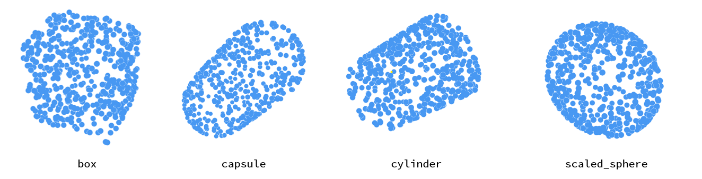
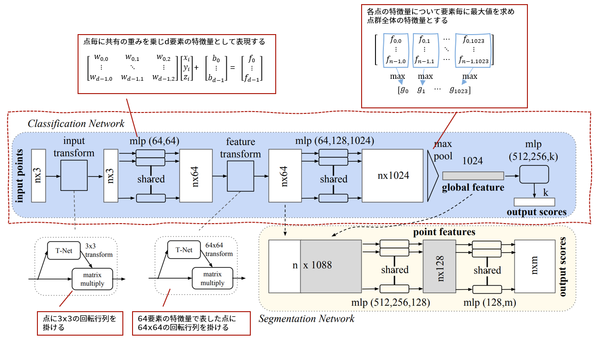
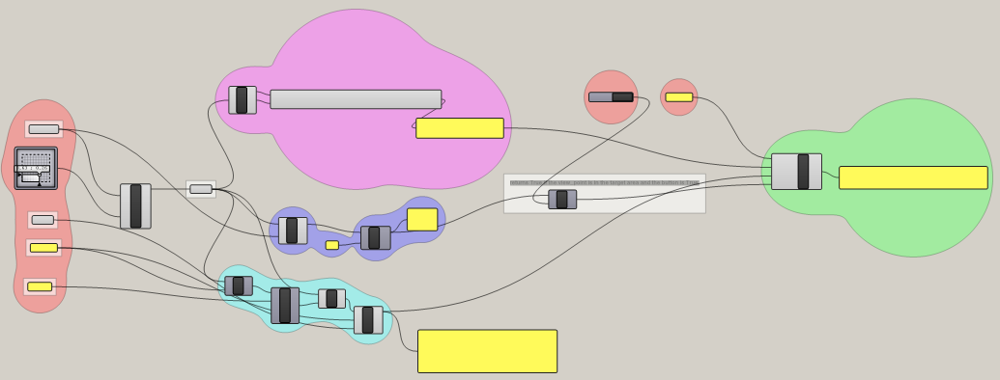

Repository: [pointnet_cla](https://github.com/ail-and-colleagues/pointnet_cla)は三次元点群を[pointnet](https://arxiv.org/abs/1612.00593)を使って分類（**cla**ssificaiton）するサンプルです。学習用のデータも三次元メッシュを操作できるライブラリ[trimesh](https://trimsh.org/index.html)を使ってply形式のデータとして生成するところも含めています。このあたりも含めて、建築学生含む情報分野が専門でない人向けに：

* データセットが簡単に用意できる
* 保守性はさておき読みやすい
* とりあえず動かしやすい

ように作成したつもりです。ゼミで使ってみた限り（windowsのみですが）手順通りで問題なく動作するのを確認しています。

また、trimeshで作成している学習用データの部分を自前のデータに移し替えて使う想定で、RhinocerosのGrasshopperで3D isovistな三次元点群を出力するサンプル「export_3D_isovist_pointcoud.gh」も置いてあります。これを使うと、[Repository(pointnet_cla](https://github.com/ail-and-colleagues/pointnet_cla))のsidenoteに付記したように、建築作品A~Xを視界の広がりにもとづき分類する、といった学習もできるかと思います。

使い方などは[Repository(pointnet_cla](https://github.com/ail-and-colleagues/pointnet_cla))のほうに書いてありますので確認ください。ここでは簡単に、できることの概要を紹介したいと思います。

### trimesh_dataset_gen.py
サンプルの学習用データを作成するスクリプトです。とりあえず動く学習用のデータが簡単に用意できることに加え、自分で用意した学習用データを用いたい場合にスムーズに変えられることの二点を意識して、三次元点群データとして良く用いられる.plyの形式のデータとしています。実行するとtrimeshに用意されているprimitiveな形状のうち、直方体（box）、カプセル（capsule）、円柱（cylinder）、各軸方向に拡大縮小した球（scaled_sphere）をクラス（分類の対象）とした学習用データが生成されます。スクリプトをいじらなければtrainデータとして各100件、validationデータとして各20件生成されますが、実際のタスクの場合はもっと多いほうが良さそうです。

なお、.plyをwindowsでそのまま開こうとすると3Dビューワーが立ち上がり、読み込むことができない旨が表示されます。よって加戸は[MeshLab](https://www.meshlab.net/)を使うことが多いです（上の図はMeshLabの画面をキャプチャしています）。

###  train＿cla.py
入力された点群が、box、capsule、cylinder、scaled_sphereのどれか分類できるよう学習を行うサンプルです。ネットワークとしては[pointnet](https://arxiv.org/abs/1612.00593)に寄りますが、実装としては[kerasのチュートリアル](https://keras.io/examples/vision/pointnet/)を使っています。

pointnetの説明は色々なウェブサイトでされていますが、簡単に説明すると次図のようなネットワークです（論文中の図に加筆しています）。pointnetには点群の分類を行うClasssification Networkと点群を構成する各点について分類を行うSegmentation Networkがありますが、ここでは分類のClasssification Networkを使っています。

点群を処理する場合、移動普遍性（移動や回転をしても変わらないこと）・順普遍性（点の順番が変わっても変わってもこと）、局所性（距離が近ければ関連が強く、遠ければ関連が弱い）の三つの性質が求められるようですが、pointnetでは移動普遍性については下側に追記してある「回転行列を掛ける」処理、順普遍性については上側に追記してある「点毎の特徴量表現」と「最大値を求め点群全体の特徴量とする処理」にて実現しています（移動普遍性については厳密には実現していないとのこと。また、局所性については改良版の[pointnet++](https://arxiv.org/abs/1706.02413)で対応しています）。後者がちょっとわかりにくいですが、点群全体の特徴量（global feature）を求めるまでは、i番目の点iは、点iの三次元座標のみを使って計算が行われている、とすると理解しやすいかもしれません。点毎にd要素（図ではd=1024）の特徴量として表現したあと、各点についてj番目の要素の最大値を求めるため、点の順が入れ替わっても結果が変わらないのがわかると思います。

### export_3D_isovist_pointcoud.gh
RhinocerosのGrasshopperで3D isovistな三次元点群を出力するサンプルです。[Repository(pointnet_cla](https://github.com/ail-and-colleagues/pointnet_cla))の**sidenote**で紹介しているように建築作品の分類を行う際に用いたものです。建築作品が自作の学習データを作るなら、ということで合わせてアップロードしてみました。

### 関連
- [pointnet](https://arxiv.org/abs/1612.00593)
- [trimesh](https://trimsh.org/index.html)
- [kerasのチュートリアル: pointnet](https://keras.io/examples/vision/pointnet/)
- [MeshLab](https://www.meshlab.net/)