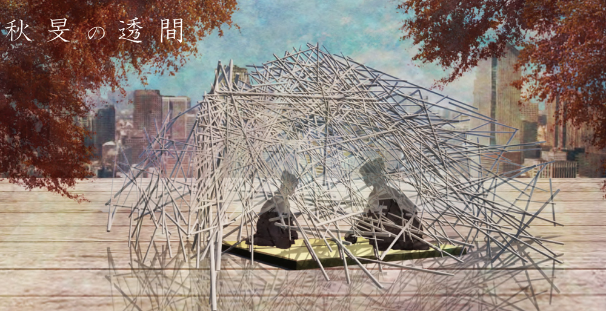
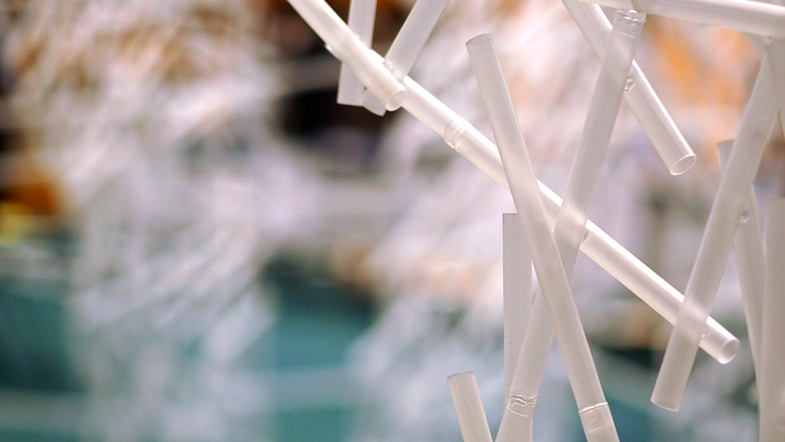
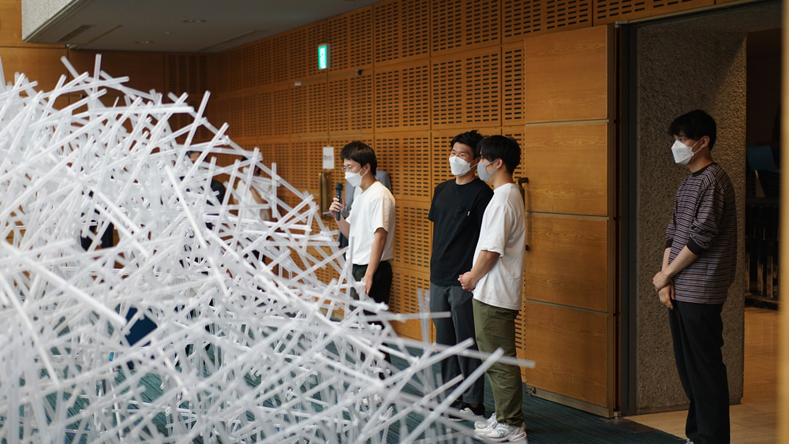
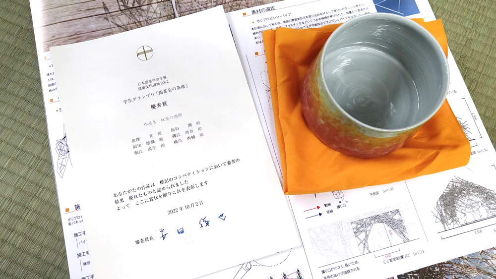

加戸研究室の学生チームによる「秋旻の隙間」（しゅうびん：さわやかに澄んだ秋の空季節、だそうです）は次図のように透明感のある細い線材で構成されるものです。上から見ると放射状に広がる18枚のパネルでできていて、外からの風景と中からの風景を大きく変化させるような操作が行われているようです。

一次審査を運良く通過できたのですが、実寸での制作にあたっては線材をどのように調達するか、どのように接合するか、という難所にあたったようです。ポリカーボネートや塩ビ、アクリルのパイプは高価で、安価なポリプロピレンのパイプ（所謂タピオカストロー）を採用したのですが、ポリプロピレンは接着剤でつかないプラスチック。コンペの審査員の先生方によるエスキスで「溶接」というアドバイスを頂き、一応接合する方法を見出しましたが、これが中々大変でしばらくはポリプロピレンの溶接がひたすら行われておりました。結果、溶接は継ぎにも採用され、次図のように良く言えば竹のような風合いのある表現となりました。

建築会館で行われた二次審査では、制作の行われた四作品それぞれについてプレゼンテーションと審査員の先生方による講評が行われました。線材の入れ方や構造的なデザインへの展開など、講評では非常に沢山の示唆を頂きました。

色々と課題も指摘されたものの、最優秀賞に次ぐ優秀賞ということで非常に栄誉ある賞（と副賞のお茶碗）を頂くことができました。コンピューターで設計したものを実寸で制作する、というなかなか無い機会を通して、学生も多くのことを学ぶことができたと思います。最後になりましたが、コンペの運営はもちろん、丁寧かつ熱のある講評を頂いた審査員の先生方にはこの場を借りてお礼申し上げます。

