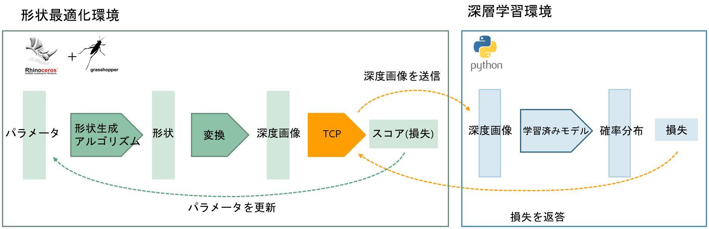

この研究は2021年度に行った[建築作品の三次元モデルから作成した3D isovist（点群）をpointnetで処理する研究](https://github.com/ail-and-colleagues/pointnet_cla#sidenote)のなかで得た **深層学習を用いると「フィッシャー邸っぽい」といった定性的な評価を行えるのでは？** という着想からスタートしています。進化的アルゴリズムでは日射取得や応力など定量的な軸が用いられますが、この評価軸に深層学習（のネットワーク）が「木漏れ日っぽい」と感じるかを加えてみよう、という報告です。

次図が最適化アルゴリズムの概要です。形状最適化環境と深層学習環境の二つから成ります。形状最適化環境はRhinoceros・Grasshopper（+Galapagos)を用いた進化的アルゴリズムを行うもの、深層学習環境は木漏れ日を学習したモデルを用意したものです。形状最適化環境にて最適化を行うイテレーションのなかで、TCP経由で深層学習環境に画像を送信しスコア（損失）を受信するコンポーネント（図中のTCP）を用い学習済みのモデルができるだけ「木漏れ日っぽい」と感じるように最適化を行います。

深層学習のネットワークは、深度画像を入力にそのクラスを推定する多クラスの分類問題を学習したものです。次図のように自前で用意した木漏れ日の画像と[ImageNet](https://www.image-net.org/)から抽出した人工物の画像を[Boosting Monocular Depth Estimation Models](http://yaksoy.github.io/highresdepth/)を用い深度画像化したものを学習用のデータセットとしました。深度画像を選択した理由としては:
* カラー画像だとべつに緑色になるよう形状最適化したいわけでないのに緑色であることが効きすぎてしまうという予想
* 最適化のイテレーションのなかである程度リアルなレンダリングを行おうとすると時間がかかる

などが挙げられます。これらを適当なサイズにクロップ、正規化してネットワークに入力しています。深層推定の精度や正規化の仕方など色々と乱暴なところはありますが、飽くまで扱うのは「木漏れ日っぽい」の「っぽい」の部分であるため、ここでは目を瞑っています。

ちなみに、この研究では「木漏れ日」をひとまず「枝葉による心地よい光の漏れ」としています。このような光の漏れが期待できる「木漏れ日っぽい」を深層学習のネットワークが適切に学習できているか可視化するために、[Attention Branch Network](https://arxiv.org/abs/1812.10025)を組み込んだネットワークを使っています。ちょっと四隅に高い反応（赤色）がでる傾向がありますが、空の抜けよりは葉の茂りを判断根拠とする傾向が確認できます。

最適化そのものは次図のようにGrrasshopper上で行われます。今回は深層学習ネットワークが「木漏れ日っぽい」と感じるかのみを軸とした単目的最適化としていますが、多目的最適化に展開しても良いと思っています。最適化の結果を見ると、Lossが下がる（≒深層学習ネットワークが木漏れ日と推定する）につれ、確かに「木漏れ日っぽい」形状になっていることが確認できます。

以上、簡単にですが、報告「深層学習と最適化を組み合わせた木漏れ日を感じるデザインの生成」について紹介しました。
情報シンポ版ではひとまず速報的な発表となって（しまって）いますが、現在、修論としてもう少し細かな調整や分析を加えているところです。
時間が許せば試作も行う計画ですので、いいモノができればまた紹介させていただければと思います。