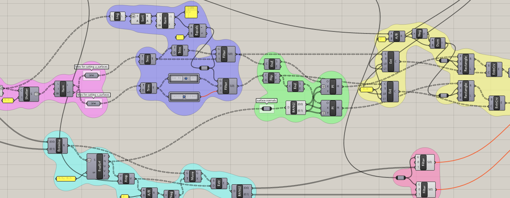

すこし前のことになるのですが、レーザーカッターを導入してみました。で、後期に向けたウォーミングアップ、そしてデジタルファブリケーションを体験してみようということで、自席のペン立てを作るというワークを研究室にて行ってみました。

学生たちとしては、レーザーカッターは先輩が卒業設計などの添景を作っていたのを見たことがある程度の認識だったので、まずはシンプルに：
- イラストレーターなどで線を描いたらその通りに自動的にカットしてくれる
- 材料としてはA3サイズ、2.5mm厚のMDFを提供。組むなら2.5mmのスリットを設ければ良い（クリアランスは不要）
- 切断面は直角

を伝え、ペン立てをデザインしてもらいました。

特に方向性を示したわけではないですが、それぞれペンが一本だけ立てられる「一ペン挿し」や、メガネ、イヤホンと色々おきたいブリッジなペン立て、ペンを複数起きつつきっちり仕切る消しゴム置きつきの多機能なペン立て、複雑な形状が好き？な学生はごそっと置くためのオーゼテック・パビリオンなプレートなど個性的なペン立てができました。

（図を差し替え）

加戸はというと、Grasshopperの練習を兼ねて、レーザーカッターでの家具やオブジェクト作成でよく見られるワッフル化を行うスクリプトを実装し、Stanford Bunny（https://ja.wikipedia.org/wiki/%E3%82%B9%E3%82%BF%E3%83%B3%E3%83%95%E3%82%A9%E3%83%BC%E3%83%89%E3%83%90%E3%83%8B%E3%83%BC ）なペン立てを作成してみました。スクリプトは[このリポジトリ（gh_wafflizer）](https://github.com/ail-and-colleagues/gh_wafflizer)にあるように、三次元モデルを入力すると自動的に相欠きで組み合うところまで処理してくれる（はず）というものになっています。詳細は[リポジトリ](https://github.com/ail-and-colleagues/gh_wafflizer)の方に書いておきましたが、やっぱりツリーの操作の部分がなかなか難しいですね。

この「自席のペン立て」のワークではとりあえずレーザーカットをしてみようと設定してみたのですが、今回学生たちが採った、**（手でモデリング→）手で加工用のデータ作成→デジタルファブリケーション機器で出力**というプロセスだと、作ろうとする部品のパターンが増えると加工用のデータを作る手間がちょっと増えます。そうすると**自動で加工してくれて嬉しい**（今回は特に手では切りにくいMDFのような素材を自動で切ってくれて嬉しい）という印象が強いようですね。デジタルファブリケーション的には、上流の**自動で加工用のデータを作成すること**もポイントになると思っているのですが、アルゴリズミックデザインと組み合わせたような**オール役物的な良さ≒手作業だと難しいユニークな部品により成り立つデザインの可能性**を実体験するには至らなかったようです。今回はひとまず導入編と位置づけることにして、**自動で加工用のデータを作成すること**を前提に**オール役物なデザイン**を考えるワークを改めて考えてみたいと思います。