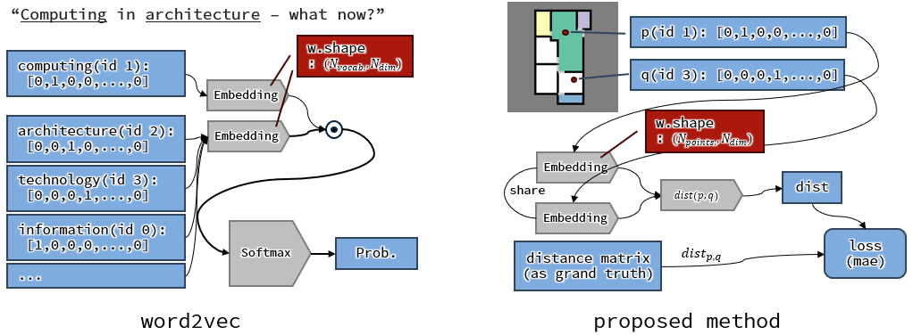
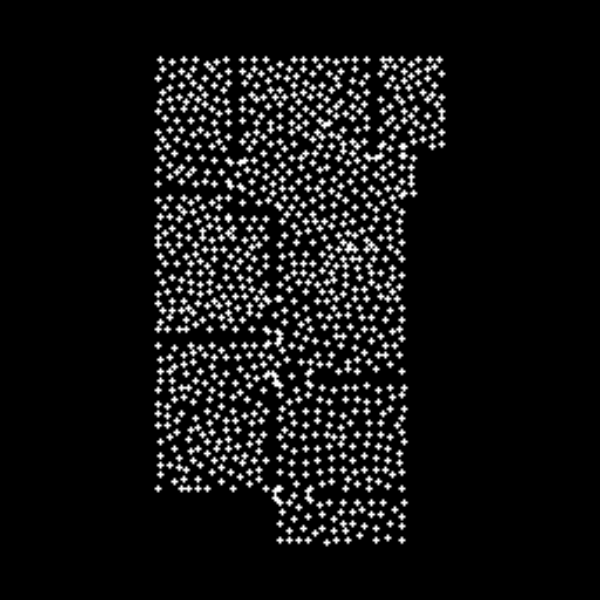
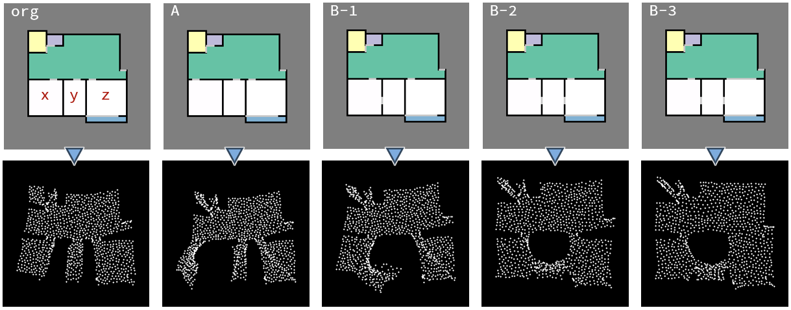
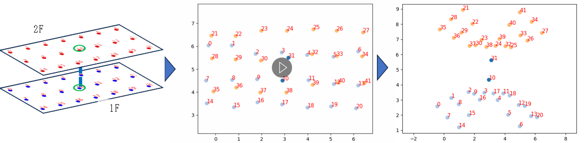

(2024年)12月5日、6日に行われました[第47回情報・システム・利用・技術シンポジウム（情報シンポ）](https://aijisa.org/2024/)にて、加戸研究室学生（UG4の高木くん）による報告「時間地図による建築空間の複雑さの表現に関する研究」が若手優秀発表賞を受賞しました。ちょっとタイミングを逃した感もありますがこの研究について紹介したいと思います。

この研究はほとんどこの学生の趣味が研究化したものです。彼は街歩きや路線図が好きな学生で、ゼミのときに[Mini Tokyo 3D](https://minitokyo3d.com/)などを眺めながら雑談をしていたのですが、（キャンパスのある西千葉駅から）「海浜幕張駅って案外遠い」という話になり、**路線図の時間地図的表現**を作ってみようというという話になりました。

このタイミングでは、**路線図の時間地図的表現**は、ある起点を中心とした表現（[スギウラ時間地図](https://kousin242.sakura.ne.jp/maruhei/fff/%e3%83%87%e3%82%b6%e3%82%a4%e3%83%b3%e3%81%a8%e3%81%af/%e3%83%80%e3%82%a4%e3%82%a2%e3%82%b0%e3%83%a9%e3%83%a0/%e6%99%82%e9%96%93%e5%9c%b0%e5%9b%b3%e3%81%ae%e8%a9%a6%e3%81%bf-4/)）を漠然とイメージしていたのですが、翌週のゼミで起点を定めないもの（[延びる路線縮んだ列島](https://www.nikkei.com/edit/interactive/rd/50shinkansen/chapter1.html)）やそのアルゴリズムの論文（[清水ら、2004](https://www.jstage.jst.go.jp/article/jscej1984/2004/765/2004_765_105/_article/-char/ja/)）が紹介され…などと雑談するなかで「建築の中でも案内図上は近そうでも結構遠いとこがある」という話から、**建築空間の時間地図的表現**を試してみるというテーマに取り組むことになりました。

前述のように時間地図のアルゴリズムはすでに存在するものの、この研究ではword2vec（[Tomas Mikolov et.al., 2013](https://arxiv.org/abs/1301.3781)）的な手法での時間地図作成を試してみました。次図（左）のようにword2vec（のSkip-Gram）ではざっくりある単語とある単語が近ければ、それぞれのベクトルの内積が1になるよう単語が埋め込まれていくのですが、この手法ではある点（ノード）とある点のベクトルの距離が点と点の時間距離となるよう埋め込みを行っていきます。具体的には、空間上のノードをすべてOne-Hot Encodingしたものを入力とし、`ノード数×2`のパラメータを持つ埋め込み層に入力します。ノードに対応する二次元座標が2つ出てくるので、その距離が正解（時間距離）になるようパラメータを更新していく、という流れになります。

時間地図は分析的に利用するというより、（通常の）地図と比較して気付きを得ようというものです。ここでは、埋め込み層のパラメータを実際の座標にしておくことで次のアニメーションのようにじわじわと時間地図表現になっていく≒通常の地図との乖離を可視化することができました。なお、この間取り画像はRPLAN（[Wenming Wu et.al., 2019](http://staff.ustc.edu.cn/~fuxm/projects/DeepLayout/index.html)）とよばれる住戸の平面図を集めたデータセットのものを使いました。

次図は同じくRPLANに含まれる間取りに少しずつ手を加えながら、それぞれを時間地図表現したものです。もとの平面図では僅かな違いであっても、時間地図表現すると部屋の接続関係に応じた距離の変化がわかりやすく可視化されています。

情報シンポの発表ではここまでだったのですが、その後、卒論では次図のように二階建ての場合なども試行しました。二階建て≒三次元になるとやはり二次元での時間地図表現は難しいようです。秋葉原駅のような複雑な空間構成は三次元での地図を…などの話も挙がりましたが、それは今後の課題、と常套句を残しつつひとまず卒論としてまとめるに至りました。

以上、雑談から始まった研究でしたが、ビジュアル的にも面白く、三次元化～など展開もありそうなものになりました。＋こういう記事化がよい機会なので[Repository: distance_embedding]((https://github.com/ail-and-colleagues/distance_embedding))の公開をしてみます。なにかの参考になれば幸いです。