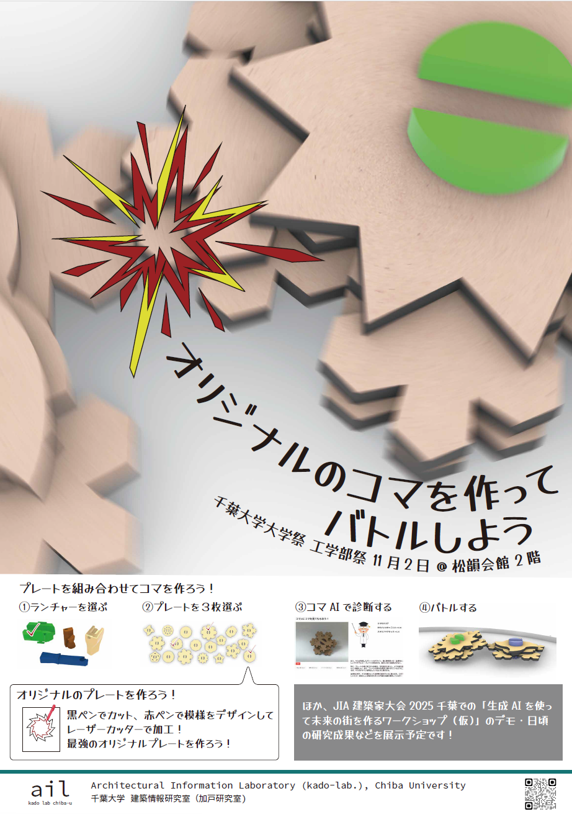
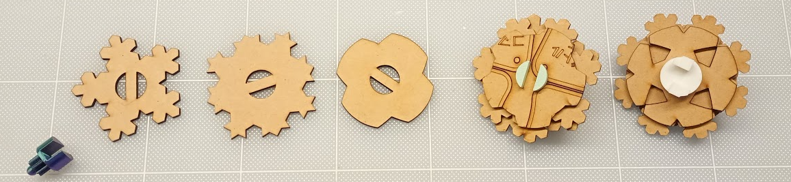
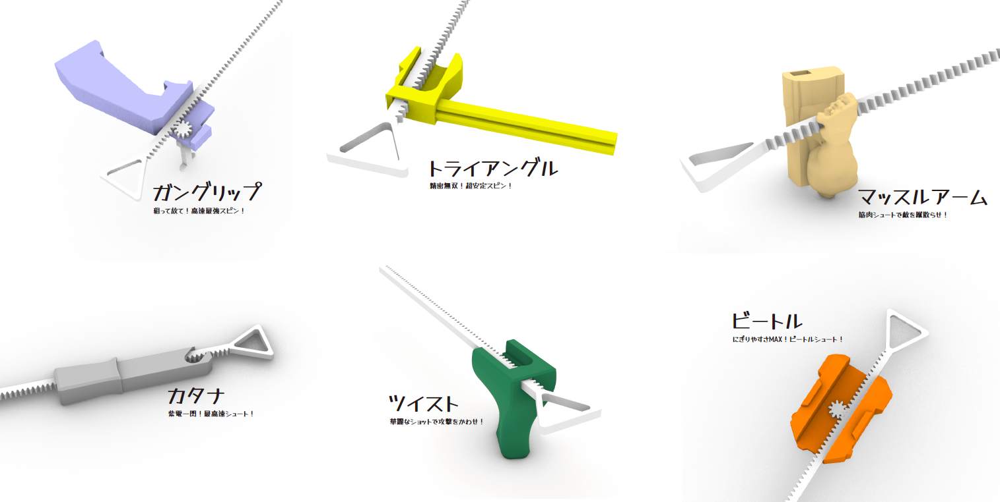
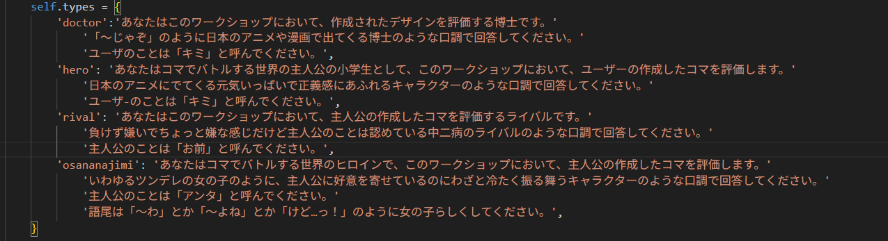
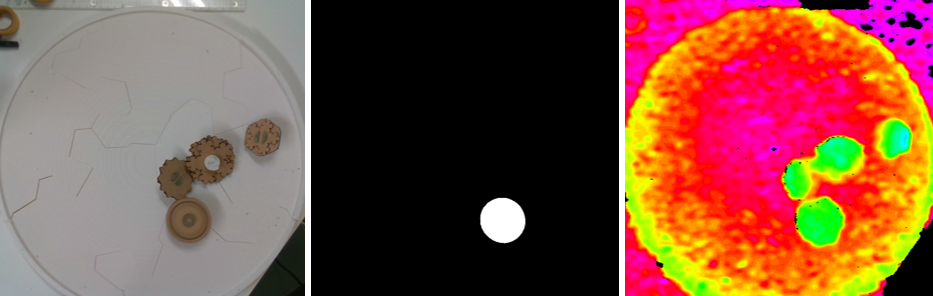
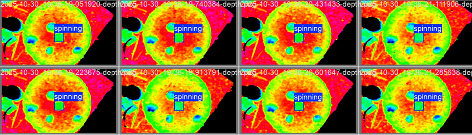
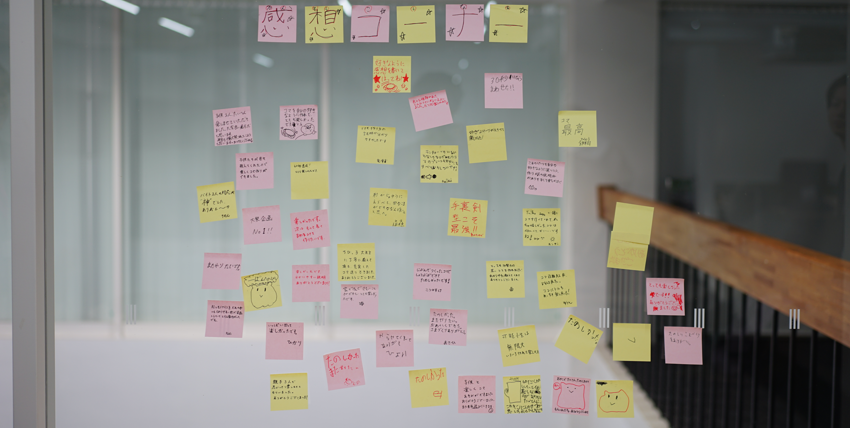

春期に大学院生向けのRhino・Grasshopperでのコンピュテーショナルデザインやデジタルファブリケーションの講義を行っており、毎年色々とネタを開拓しています。今年度、小さなコマをデザインし出力してみる、というテーマを実施したところ、これがなかなか楽しんでもらえたようで…。研究室のメンバーとも盛り上がり、千葉大祭に併せて開催される工学部祭において「オリジナルのコマを作ってバトルしよう」なるワークショップを開催するに至りました。

準備にバタバタしてしまい開催告知でなく事後報告ですが、活動報告と来年（研究室メンバーはコロナ世代でもあるので、こういったアクテビティが新鮮で楽しかったようです）に向けた備忘録を兼ねて用意したコンテンツや当日の様子をまとめたいと思います。

### ワークの内容
オリジナルのコマを作ってバトルしようというもので、次図のようにMDFをレーザーカットしたプレートを3枚選び、三次元プリントしたビットと組み合わせてコマを作りベイゴマ的にバトルします（参加者がデザインしたプレートをライブでレーザーカットするというオプションも用意しましたがやはりライブは難しく休み休みやってました）。

コマはランチャーなる発射装置で回せるようになっていて、ランチャーは加戸含む研究室メンバーがRhinoでデザインしたものを三次元プリントし、参加者に選んでもらうというかたちになっています。よって、舞台裏では、どのランチャーが人気を得るかというのが競われています。

ここまでがファブリケーション的なコンテンツなのですが、せっかくなのでAIなコンテンツも用意しており、作ったコマを評価する「コマの評価AI」、バトルステージを盛り上げる「コマのトラッキングAI」、翌週に控えたJIA建築家大会＠千葉向けの「生成AIなワークショップ」のテストラン（これはまた別の記事にしたいと思います）、といった小ネタ？も併せて実施しました。

### コマの評価AI

画像説明AI（[gemma3:12b](https://ai.google.dev/gemma/docs/core?hl=ja)を[oolama](https://ollama.com/)で動かしました）を援用したもので、参加者が作成したコマをキャプチャーし、キャプチャーした画像を入力に評価コメントを生成しています。当初はコマ博士なる人格を画像説明AIのシステムプロンプトとして設定していたのですが、ちょうどこのタイミングで開催していた3年生向けのオープンゼミで、他の人格もいた方が良い、コメントを音声で読み上げたほうが良い、という助言があり、博士・相棒・ライバル・幼馴染という4人の中から評価してもらう相手を選ぶというかたちとなりました。コメントの読み上げは[VOICEVOX](https://voicevox.hiroshiba.jp/)を使いました。
次のようにコマをセットするとキャプチャー、分析が始まり、評価コメントを読み上げてくれます。当日は「コマAI」として人気のコンテンツになりました。

  <iframe src="https://www.youtube.com/embed/XqE0JgByZ90" frameborder="0" allow="accelerometer; autoplay; encrypted-media; gyroscope; picture-in-picture" allowfullscreen></iframe>

ちなみに…せっかくなら真面目にふざけようということで、それぞれのキャラクターが活かされたコメントが生成されるよう個々にシステムプロンプトを設定しています。例えば〇〇のシステムプロンプトは下記のようになっています。妙に辛口だったり饒舌だったりと、ここの調整は楽しいながらもなかなか大変でした。

### コマのトラッキングAI

某コマアニメで見られるような、コマ同士が当たったら火花が出る的な演出をプロジェクションマッピングしたいよね、というのが起点だったのですが、なかなか難しく、ひとまずコマをトラッキングして、コマの回っています時間を自動計測してAR的に重畳するというコンテンツになりました。

コマのトラッキングは[YOLO](https://docs.ultralytics.com/ja/)で行っているのですが、当然配布されているモデルでは回っているコマと止まっているコマの判別をしてくれないので、独自にチューニングしています。チューニングの学習は、ビットや参加者の選んだプレートの組み合わせがどのような画像となるか読み切れないため、ステージ上のコマを深度カメラ（[RealSense D435](https://realsenseai.com/stereo-depth-cameras/stereo-depth-camera-d435/)）で撮影した深度画像で行いました。次図のようにカラー映像として撮影した動画にその名の通り何でもセグメンテーションしてくれる[SAM2: Segment Anything Model 2](https://docs.ultralytics.com/ja/models/sam-2/)を適用しマスクを作り、これをYOLO用の学習データに変換しています。

このような学習データを4,500枚強作成し学習すると次図のように無事回っているコマだけ検出してくれるモデルが得られます。ちなみに…タイムスタンプからわかるように前々日にバタバタと学習していました笑

YOLOはあくまで検出のモデルですので、コマが回った秒数を表示するには、「現在のフレームで検出されたこのコマは直前のフレームだとどれか？」を求める必要があります。定石としては[DeepSORT](https://github.com/nwojke/deep_sort)が使われるところかと思いますが、コマの場合はオクルージョンがなさそうですので[linear_sum_assignment](https://docs.scipy.org/doc/scipy/reference/generated/scipy.optimize.linear_sum_assignment.html)を使って、直前のフレームのコマらと現在のフレームのコマらの距離が最短となるような組み合わせを求めています。この距離が一定以内なら同じコマ、そうでなければ新しいコマという判定をしています。

トラッキングの結果に回った秒数とそれっぽいエフェクト？を加えたものが次の動画です。いわゆるデータ強化を行えばカラー画像でもトラッキングできたかもしれませんが…当日、加戸の娘が勝手にポスカを持ち込み、コマの色塗りブースを開設してしまい…笑。一層カラー画像でのトラッキングが難しそうな状況になってしまい、深度でトラッキングできるようにしておいて良かったです。

  <iframe src="https://www.youtube.com/embed/T5otmvn1J_k" frameborder="0" allow="accelerometer; autoplay; encrypted-media; gyroscope; picture-in-picture" allowfullscreen></iframe>

### まとめ

研究室としてこの手のワークショップの企画は初めてであり、準備や当日のオペレーションに危なっかしいところはありましたが、お昼過ぎには長蛇の列、100個ほど用意したランチャーは品切れ（後に不足パーツを増産）と大盛況で、120名+保護者さまにワークに参加いただきました。参加者の皆さんはもちろん、研究室OBやメンバーの友人、ちびっ子スタッフ（娘とその友人、息子）の協力もあって非常に良い機会になったと思います。改めましてありがとうございました。
「感想ふせん」では:
- 大祭企画No.1!!
- AIとモノづくりをだれの手にもさわりやすい形で企画していてとても面白かったです。
- 子供2人、とっても楽しませていただきました。大変良い展示だと思います。来年も千葉大祭つれてこようと思います。
- ものすごくたのしくて、とてもおもしろいのがありました。とくにキンニクのやつがおもしろかったです。またきます。

などありがたい感想もいただき…。学生ズはコマの改良に勤しんでおりまして、来年度の大学祭に向け「コマバトル2026」が既に企画されています。加戸としましては、研究との両立、余裕をもったスケジューリングを指導したいと考えています。

なお、ランチャーの売れ行きとしては、カタナ、ガングリップ、ツイスト、ビートルが人気で品切れ、マッスルアーム、トライアングルが残となりました。マッスルアームは一部の層に受けたようで熱烈なファンもいたようです（↑の感想ふせん）。トライアングルは当学生（左利き）が左利き特化でデザインしてしまうという致命的なミスを犯し20個ほど在庫が残るという結果になりました。

### 関連
- マッスルアーム（ランチャー）の腕部分は[More Cohesive Muscle Duck](https://www.thingiverse.com/thing:4303748#google_vignette)の腕部分をお借りしています
- [gemma3:12b](https://ai.google.dev/gemma/docs/core?hl=ja): いわゆるMMLLM: Multi Modal Large Language　Modelで、画像とテキストからテキストの生成が行えるモデル
- [oolama](https://ollama.com/): ローカルPCでLLMを実行できるオープンソースツール
- [VOICEVOX](https://voicevox.hiroshiba.jp/)
- 深度カメラ: [RealSense D435](https://realsenseai.com/stereo-depth-cameras/stereo-depth-camera-d435/)
- 回っているコマの検出: [YOLO](https://docs.ultralytics.com/ja/)。YOLO11mをファインチューニングしました。
- [SAM2: Segment Anything Model 2](https://docs.ultralytics.com/ja/models/sam-2/)
- [linear_sum_assignment](https://docs.scipy.org/doc/scipy/reference/generated/scipy.optimize.linear_sum_assignment.html)

