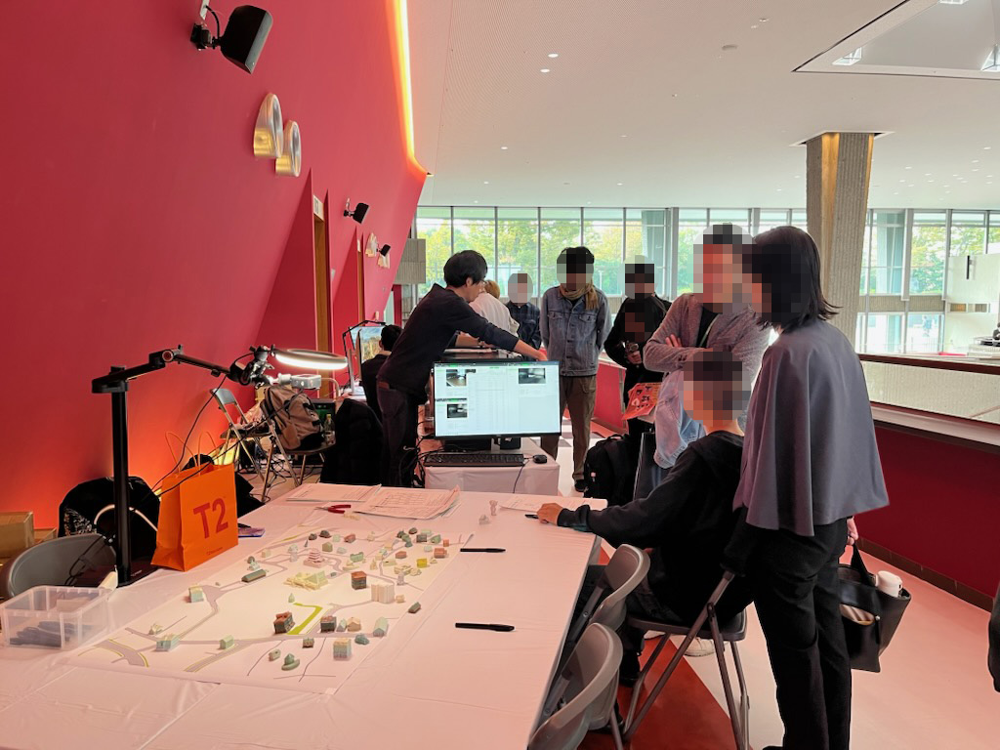
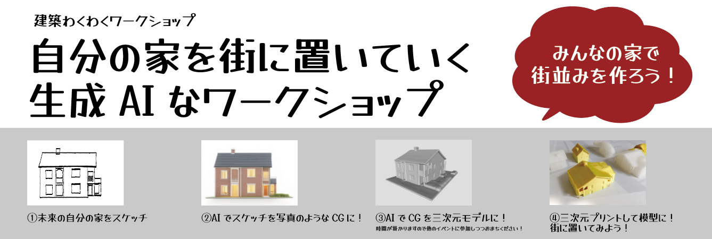
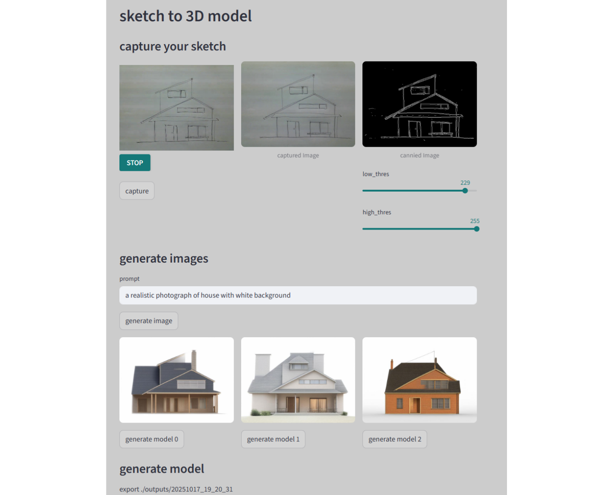
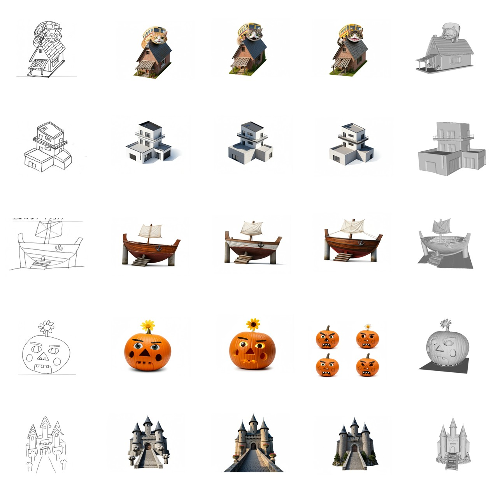
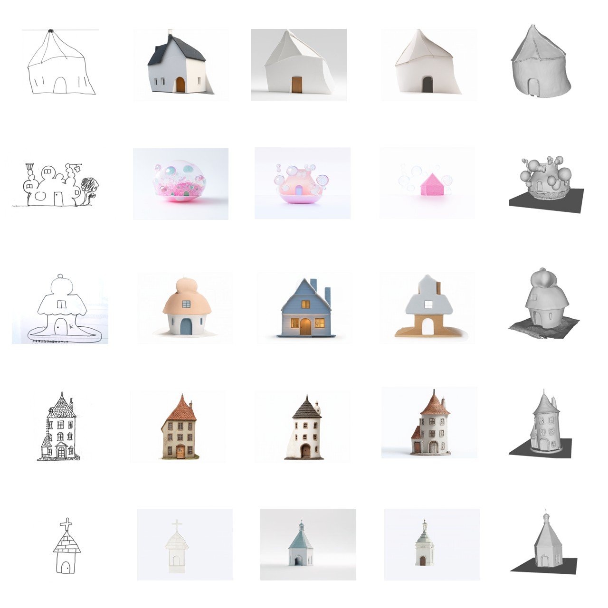
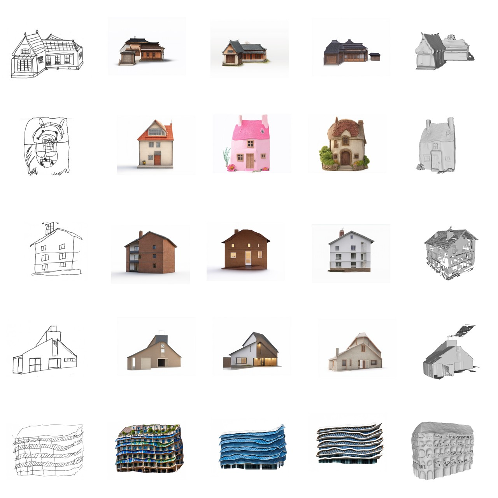
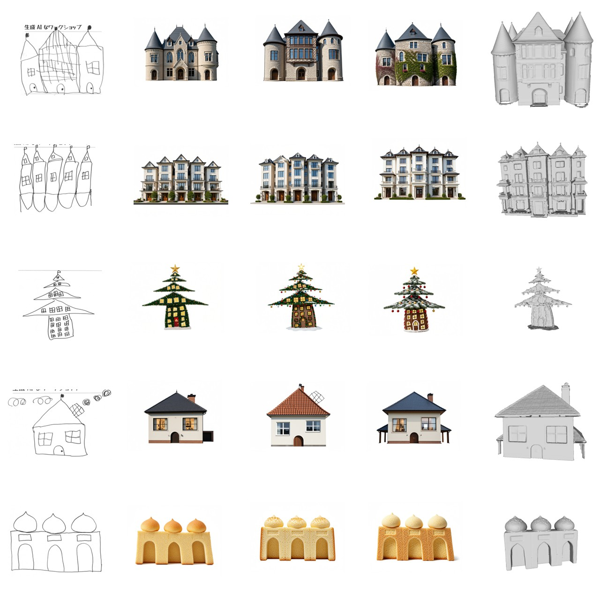

11月7-8日に千葉県文化会館で開催された[JIA建築家大会2025](https://jia-convention.net/2025chiba/index.html)の企画「けんちくワクワクワークショップ」において、「自分の家に街を置いていく生成AIなワークショップ」を開催しました。当日の様子と合わせて簡単にワークショップについて紹介します。

### ワークの内容

このワークショップは、街に置きたい自分の家のスケッチから画像生成AI・画像編集AIでリアルな画像に、その画像を三次元モデル生成AIに入力し三次元モデルに、最後に三次元プリンタで出力し、街に置いていくというものです。

### 画像生成AI・画像編集AI

今回のワークショップでは、参加者の描いたスケッチからリアルな画像を生成するにあたり、画像生成AIと画像編集AIの2つのバージョンのAIを用いました。

画像生成AIは所謂「指示文（プロンプト）から絵を描く」Text to Imageが可能なAIで、これに線画によるコントロールを加えた[ControlNet-canny](https://huggingface.co/lllyasviel/ControlNet)と呼ばれるテクニックを加えたものを用いました。参加者の描いたスケッチに対し「コンクリート造の住宅」のようなプロンプトを入力し、「スケッチを参考にした画像」を生成していきます。具体的には画像生成を行うベースモデルに[tensorart/sd3.5m-controlnet-cannytensorart](https://huggingface.co/tensorart/stable-diffusion-3.5-medium-turbo)、ControlNetには[tensorart/SD3.5M-Controlnet-Canny](https://huggingface.co/tensorart/SD3.5M-Controlnet-Canny)を使いました。これらを始めありがたいことにオープンなモデルは色々選択肢があるのですが、今回はワークショップに持ち込むPCのビデオカード（RTX 5060ti）で現実的な時間で生成できることを条件に選定しました。640×640の画像を生成するのに20秒ちょっと、3パターンの画像を作成して選んでもらうという手順にしたため一分強お待ちいただくかたちになりました。

画像編集AIは、比較的新しいもので、「この画像をこうして」といったように加工してほしい画像と指示文を入力に画像を得ようというものです。こちらも参加者の描いたスケッチに対し「コンクリート造の住宅」のようなプロンプトを入力し画像を生成していきますが、画像生成AIのほうが「スケッチを参考にした画像」を生成するのに対し、こちらではどちらかというと「スケッチをうまく塗ったような画像」が生成できます。ベースモデルは[Qwen/Qwen-Image-Edit](https://huggingface.co/Qwen/Qwen-Image-Edit)を用いました。こちらは現実的な時間で生成しようとすと要求スペックが非常に高く…RTX5090をちょっとドキドキしながら会場に持ち込みました笑。640×640の画像を生成するのに同じく20秒ちょっとかかります。このAIの描画能力はすごいの一言で、無茶なスケッチ（失礼…）もうまいこと建築物っぽい画像にしてくれます。よって、画像生成AIのほうでどうにもうまく画像化できない場合は画像編集AIのほうで再チャレンジのような二段構えができました。参加者がどんなスケッチを描くか読めないので2つくらいバージョンがあると良いよねという保険がうまく効きました（画像編集AIバージョンを実装してくれた修士学生に感謝…）。

### 三次元モデル生成

参加者に生成したリアルな画像のうち、気に入ったものを選んでいただいたら、それを三次元モデル生成AIに入力して三次元のメッシュにします。これには[Tencent-Hunyuan/Hunyuan3D-2](https://github.com/Tencent-Hunyuan/Hunyuan3D-2)というAIを用いています。なお、このモデルはテクスチャ付きのメッシュも作成できるのですが、処理時間を節約するためにこのオプションは外して用いました。

ワークショップの準備を始めたころは、画像生成を行うPCでメッシュ化まで行うような手順を想定していましたが、[大学祭で行ったコマのワークショップ](https://ail-and-colleagues.github.io/komabattle2025.html)　で得た「当日は思った以上にワタワタするよね」という経験から、別にメッシュ化を行うPCを用意し、画像生成を行うPCから画像を受け取ったら自動的にメッシュ化を行う、という手順をとることにしました。

参加いただいた皆さまのスケッチ→イメージ（生成画像）→三次元モデルをまとめたものが次の図になります。スケッチの特徴をうまく拾っているものや、こうきたか…、というものなど、所謂「インスピレーションを得る」という意味では画像生成（・編集）AIともになかなかの品質のものが描けているように思います。三次元モデル化については、生成画像が色々な意味で「わかりやすい」ものであればうまくいく傾向が顕著でした。また、[Tencent-Hunyuan/Hunyuan3D-2](https://github.com/Tencent-Hunyuan/Hunyuan3D-2)含め三次元モデル生成AIで作成されるメッシュは必ずしも「三次元プリントできる」とは限らないようで、スライサーがうまく解釈できないものが結構ありました。

### 三次元プリント

メッシュ化が済んだら三次元プリントしていきます。加戸研にある[Bambu Lab P1S](https://jp.store.bambulab.com/products/p1s?gad_source=1&gad_campaignid=21743014773&gbraid=0AAAAA9n4HT0XSPVtDN8MsN-YcsPPggPy9&gclid=CjwKCAiAraXJBhBJEiwAjz7MZZvvCSXZPCP6HNFQoYaBaomTyhvTfqqkw7wGU9kvxuvAFeeEupwGDxoCqzoQAvD_BwE)に加え、[鈴木研](https://suz-hiro.wixsite.com/suzukilab-archi)からも同じくP1Sを2台お借りした3台体制で対応しました。

待ち時間は他のイベント（ワークショップ）に参加していただくようなイメージでいたのですが、三次元プリンタの前で造形の様子を眺めていたり、他の参加者のスケッチ to 画像を眺めていたりといった参加者が多く、色々な楽しみかたをしていただけたように思っています。
なお、本当はスケールを揃えて造形したかったのですが、今回は時間優先ということで、一つの模型あたり20分以内に造形が終わるよう1/300~1/400程度になるよう適当に調整しています。

  <iframe src="https://www.youtube.com/embed/AgZZ8oMSrVI" frameborder="0" allow="accelerometer; autoplay; encrypted-media; gyroscope; picture-in-picture" allowfullscreen></iframe>

### まとめ
[大学祭で行ったコマのワークショップ](https://ail-and-colleagues.github.io/komabattle2025.html)の翌週という慌ただしさの中の実施ではありましたが、大会の実行委員や他のブースでワークショップをされていた皆さまのご協力もあって、なかなか盛況だったように思います。加戸自身はあまりJIA大会にはご縁語がなく、大会の実行委員長を務められた本コースの鈴木先生にお声がけいただき開催させていただいたのですがとても楽しい機会になりました。強いて言えば、より専門的な質問などに対応するために、もう少し技術的・研究的な背景を紹介する準備をしておけば良かったように思いました。

最後になりましたが、本ワークショップのご協賛いただいた株式会社新昭和さまに改めまして感謝申し上げます。

### 関連
- [ControlNet-canny](https://huggingface.co/lllyasviel/ControlNet)
- [tensorart/sd3.5m-controlnet-cannytensorart](https://huggingface.co/tensorart/stable-diffusion-3.5-medium-turbo)
- [tensorart/SD3.5M-Controlnet-Canny](https://huggingface.co/tensorart/SD3.5M-Controlnet-Canny)
- [Qwen/Qwen-Image-Edit](https://huggingface.co/Qwen/Qwen-Image-Edit)
- [Tencent-Hunyuan/Hunyuan3D-2](https://github.com/Tencent-Hunyuan/Hunyuan3D-2)
- [Bambu Lab P1S](https://jp.store.bambulab.com/products/p1s?gad_source=1&gad_campaignid=21743014773&gbraid=0AAAAA9n4HT0XSPVtDN8MsN-YcsPPggPy9&gclid=CjwKCAiAraXJBhBJEiwAjz7MZZvvCSXZPCP6HNFQoYaBaomTyhvTfqqkw7wGU9kvxuvAFeeEupwGDxoCqzoQAvD_BwE)

